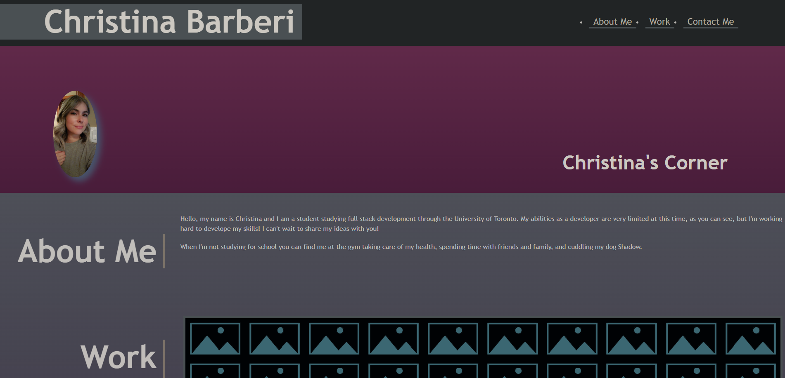

# My portfolio

## Portfolio for Christina Barberi

## User Story

As an employer I want to view a potential employee's deployed portfolio of work samples so that I can review samples of their work and assess whether they're a good candidate for an open position.

## Acceptable Criteria

Here are the critical requirements necessary to develop a portfolio that satisfies a typical hiring manager's needs:

GIVEN I need to sample a potential employee's previous work
WHEN I load their portfolio
THEN I am presented with the developer's name, a recent photo or avatar, and links to sections about them, their work, and how to contact them
WHEN I click one of the links in the navigation
THEN the UI scrolls to the corresponding section
WHEN I click on the link to the section about their work
THEN the UI scrolls to a section with titled images of the developer's applications
WHEN I am presented with the developer's first application
THEN that application's image should be larger in size than the others
WHEN I click on the images of the applications
THEN I am taken to that deployed application
WHEN I resize the page or view the site on various screens and devices
THEN I am presented with a responsive layout that adapts to my viewport

## Description:

In this assignment I am attempting to make a website that includes my name, a recent photo, working links that direct you to the correspoding sections and how to contact me.

## Screenshot:

# Link to deployed website:

Portfolio: https://christinaecb.github.io/Challenge-Two/